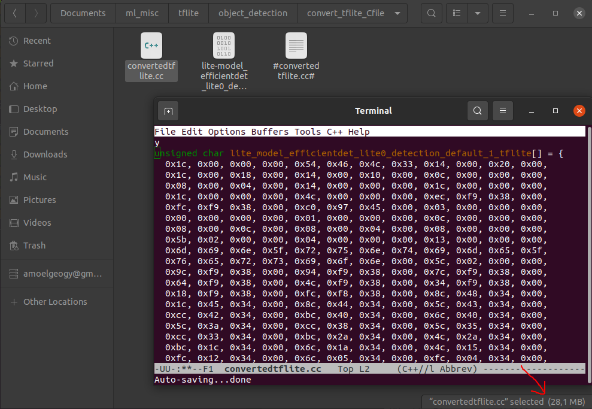

## object detection tf

### Note: the .tflite model returns the output in this order: boxes, classes, scores, num_detections. the number of bbox detections per image is 25 for .tflite models.
### the bboxes are in the format ymin, xmin, ymax, xmax --> corresponds to boxes[0][i][0], boxes[0][i][1], boxes[0][i][2], boxes[0][i][3]

#### tflite_load_model.ipynb
load a model from tfhub using the provided link, get the prediction and visualize the outputs  
load a model from a .tflite file, create an interpreter and predict the output  
time the tflite model's invoke method (the invoke method calculated the model prediction)  

#### test_tflite_models.py
load and test .tflite models  

#### coco_filter.py
code source: https://stackoverflow.com/a/68834777  
1. saves images/annotations from categories  
2. creates new json by filtering the main json file  

#### filtered_cocodataset_test.ipynb
examine the filtered coco dataset which was created from coco_filter.py. visualize some images  

#### mAP/compare_ground_truth_bbox_to_predicted_bbox.ipynb
the ground truth bboxes are compared to the predicted bboxes and the precision and recall are calculated per image for a given confidence threshold and iou threshold  

#### my_custom_dataset/coco_2_csv.ipynb
initial code to convert from the coco format to the csv format as is used by the [tflite model maker](https://www.tensorflow.org/lite/models/modify/model_maker/object_detection). 

### in tflite_load_model.ipynb check why inference takes so long for the tflite model (time shown in seconds). the inference time should be ~50 ms (scroll down for findings)
#### local CPU
  

#### colab GPU
  

#### colab TPU
  

#### colab CPU
  

#### convert from tflite to C file 
 
conversion was done on a linux machine using xxd  
xxd -i sourcefilename.tflite targetfilename.cc  

#### reasons for inference time being slow
TFLite focuses more on on-device performance. So it is not as optimized when you run it on a x86 machines compared to arm devices for example. source: https://stackoverflow.com/questions/70911977/is-there-any-method-to-decrease-tensorflow-lite-invoke-time-in-c  
The term inference refers to the process of executing a TensorFlow Lite model **on-device** in order to make predictions based on input data. source: The term inference refers to the process of executing a TensorFlow Lite model on-device in order to make predictions based on input data.  

