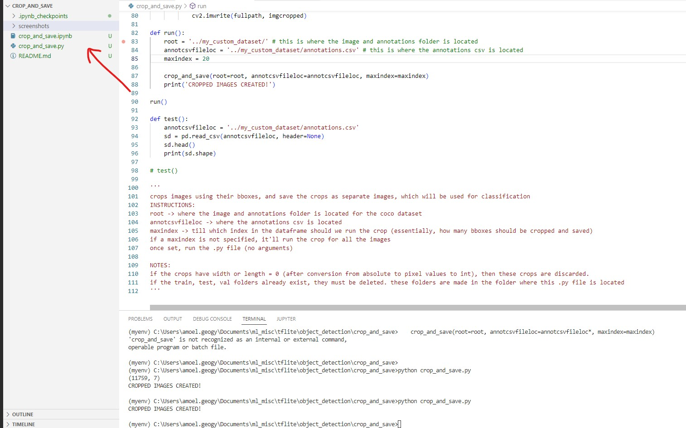
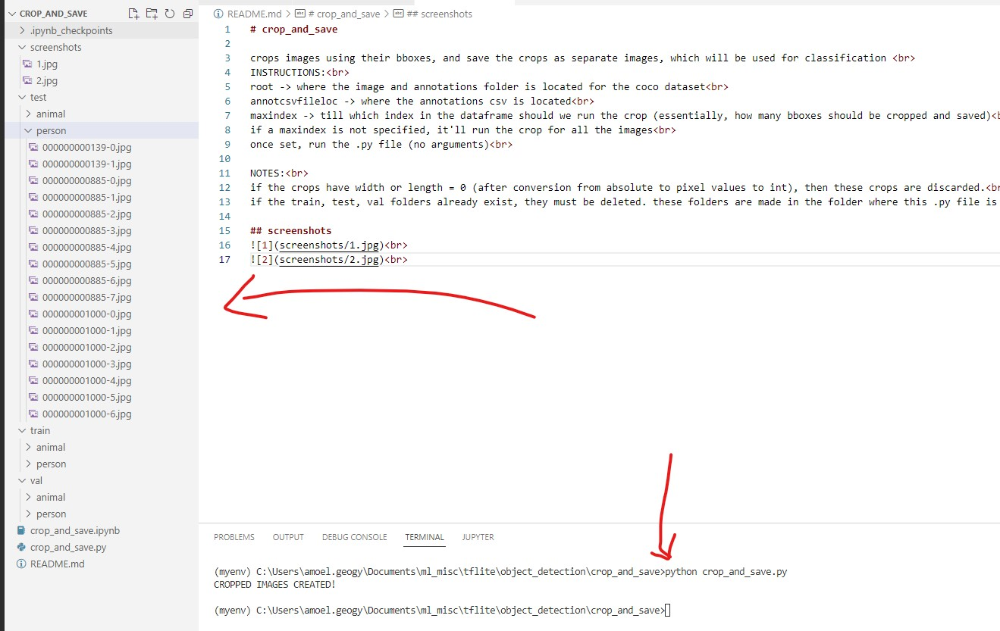

# crop_and_save

crops images using their bboxes, and save the crops as separate images, which will be used for classification  
INSTRUCTIONS: 
root -> where the image and annotations folder is located for the coco dataset 
annotcsvfileloc -> where the annotations csv is located 
maxindex -> till which index in the dataframe should we run the crop (essentially, how many bboxes should be cropped and saved) 
if a maxindex is not specified, it'll run the crop for all the images 
once set, run the .py file (no arguments) 

NOTES: 
if the crops have width or length = 0 (after conversion from absolute to pixel values to int), then these crops are discarded. 
if the train, test, val folders already exist, they must be deleted. these folders are made in the folder where this .py file is located 

## screenshots
 
 