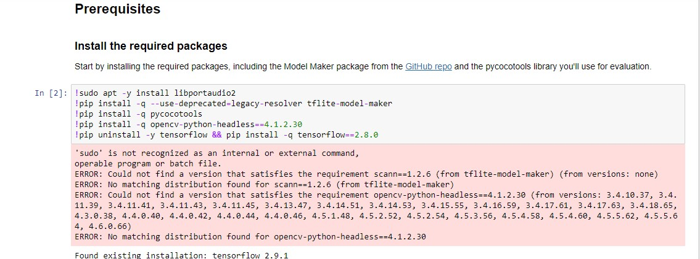
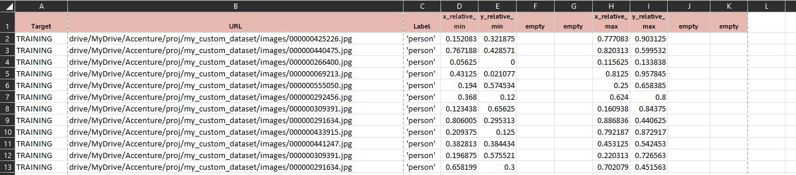
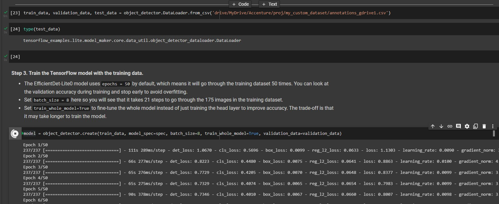

# tflite model_maker

the model maker was tested in google colab. i tried to do it on my local windows computer, but the !pip installation commands and !sudo commands are written for Linux, so it didnt run correctly on windows.  
  

## running on google colab
* first, the annotations file was created in the following format:
  

* the right path to the csv file was given, and the model was run. everything was kept as it was. only the path to the csv file was changed
  
