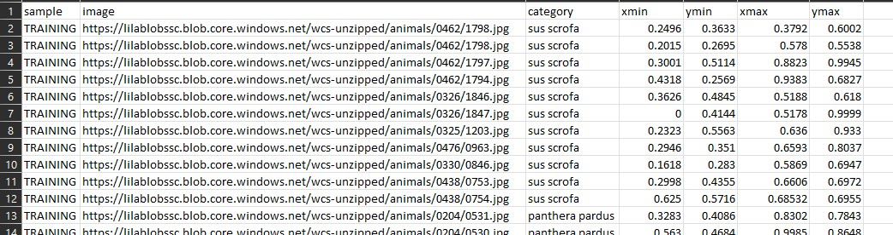

## wcs to tflite model maker csv

dataset source: https://lila.science/datasets/wcscameratraps A function was created that converts the annotations from the format given in the source to the format accepted by tflite model maker (the blank columns after xmin, ymin and xmax, ymax havent been inserted)
a function was created, which accepts the image url and displays the image with the bboxes. use df.head() to get some image urls.
**Note:**  
* the images are accessed directly from the cloud, and is not saved locally
* the wcs_to_csv function takes a few minutes to run 
* the first column is always filled with the value 'TRAINING', as we may combine multiple datasets, and split into train, val, test only after that

### created script to convert wcs to csv 
#### input format:
  
  

#### output format:
  